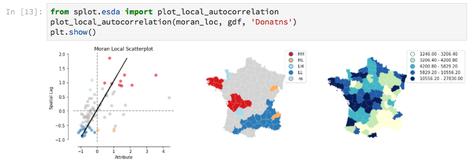

# splot

**Visual analytics for spatial analysis with PySAL.**

## What is splot?

`splot` connects spatial analysis done in [`PySAL`](https://github.com/pysal) to different popular visualization toolkits like [`matplotlib`](https://matplotlib.org).
The `splot` package allows you to create both static plots ready for publication and interactive visualizations for quick iteration and spatial data exploration. The primary goal of `splot` is to enable you to visualize popular PySAL objects and gives you different views on your spatial analysis workflow.

If you are new to splot and PySAL you will best get started with our [documentation](https://splot.readthedocs.io/en/latest/) and the short introduction [video](https://youtu.be/kriQOJMycIQ?t=2403) of the package at the Scipy 2018 conference!

## Installing splot

### Installing dependencies:

splot is compatible with `Python` 3.6 and 3.7 and depends on `geopandas` 0.4.0 or later and `matplotlib` 2.2.2 or later.

splot also uses
* `numpy`
* `seaborn`
* `mapclassify`
* `Ipywidgets`

Depending on your spatial analysis workflow and the PySAL objects you would like to visualize, splot relies on:
* PySAL 2.0

or separate packages found in the PySAL stack:
* esda
* libpysal
* spreg
* giddy

### Installing splot:

There are two ways of accessing splot. First, splot is installed with the [PySAL 2.0](https://pysal.readthedocs.io/en/latest/installation.html) metapackage through:

    $ pip install -U pysal
    
    or 
    
    $ conda install -c conda-forge pysal

Second, splot can be installed as a separate package. If you are using Anaconda, install splot via the conda utility:

    $ conda install -c conda-forge splot

Otherwise you can install splot from PyPI with pip:

    $ pip install splot

## Usage

Usage examples for different spatial statistical workflows are provided as [notebooks](https://github.com/pysal/splot/tree/master/notebooks):
* [for creating value-by-alpha maps](https://github.com/pysal/splot/blob/master/notebooks/mapping_vba.ipynb)
* [for assessing the relationship between neighbouring polygones](https://github.com/pysal/splot/blob/master/notebooks/libpysal_non_planar_joins_viz.ipynb)
* [for the visualization of space-time autocorrelation](https://github.com/pysal/splot/blob/master/notebooks/giddy_space_time.ipynb), also documented in [giddy](https://github.com/pysal/giddy/blob/master/notebooks/directional.ipynb)
* for visualizing spatial autocorrelation of [univariate](https://github.com/pysal/splot/blob/master/notebooks/esda_morans_viz.ipynb) or [multivariate](https://github.com/pysal/splot/blob/master/notebooks/esda_moran_matrix_viz.ipynb) variable analysis

You can also check our [documentation](https://splot.readthedocs.io/en/latest/) for examples on how to use each function.

A detailed report about the development, structure and usage of splot can be found [here](https://gist.github.com/slumnitz/a86ef4a5b48b1b5fac41e91cfd05fff2). 

## Contributing to splot

`splot` is an open source project within the Python Spatial Analysis Library that is supported by a community of Geographers, visualization lovers, map fans, users and data scientists. As a community we work together to create splot as our own spatial visualization toolkit and will gratefully and humbly accept any contributions and ideas you might bring into this project. 

Feel free to check out our dicussion spaces, add ideas and contributions:
* [Idea collection](https://github.com/pysal/splot/issues/10) which PySAL objects to support and how new visualizations could look like
* [Discussion](https://github.com/pysal/splot/issues/9) about the splot API
* Ideas how to integrate [other popular visualization toolkits](https://github.com/pysal/splot/issues/22) like `Bokeh` or `Altair`

If you have never contributed before or you are just discovering what PySAL and splot have to offer, reading through """Doc-strings""" and correcting our Documentation can be a great way to start. Check for spelling and grammar mistakes or use [pep8](https://pypi.org/project/pep8/) and [pyflakes](https://pypi.org/project/pyflakes/) to clean our `.py` files. This will allow you to get used to working with [git](https://try.github.io) and generally allows you to familiarize yourself with the `splot` and `PySAL` code base.

If you have already used PySAL and splot and you are missing object-specific views for your analysis feel free to add to our code-base or discuss your ideas. Please make sure you include unit test, documentation and examples or (create an issue so someone else can work together with you). The common `splot` API design discussed [here](https://github.com/pysal/splot/issues/9) can help you to decide how to best integrate your visualization prototype into `splot`.

Beyond working on documentation and prototyping new visualizations, you can always write a bug report or feature request on [Github issues](https://github.com/pysal/splot/issues). Whether large or small, any contribution makes a big difference and we hope you enjoy being part of our community as much as we do! The only thing we ask is that you abide principles of openness, respect, and consideration of others as described in the [PySAL Code of Conduct](https://github.com/pysal/code_of_conduct/blob/master/README.md).

## Road-map

We are planning on extending splot's visualization toolkit in future. Functionality we plan to implement includes:

* visualisations for [density methods](https://github.com/pysal/splot/issues/32) (mapping density estimations)
* [cross-hatching fill styles](https://github.com/pysal/splot/issues/35) for maps (to allow choropleth visualizations without class intervals)
* [legendgrams](https://github.com/pysal/splot/issues/34) (map legends that visualize the distribution of observations by color in a given map)

If you are interested in working on one of these or any other methods, check out the linked issues or get in touch! 

## Community support

* [PySAL 2.0](http://pysal.org)
* [Gitter chat splot](https://gitter.im/pysal/splot?utm_source=badge&utm_medium=badge&utm_campaign=pr-badge&utm_content=badge)
